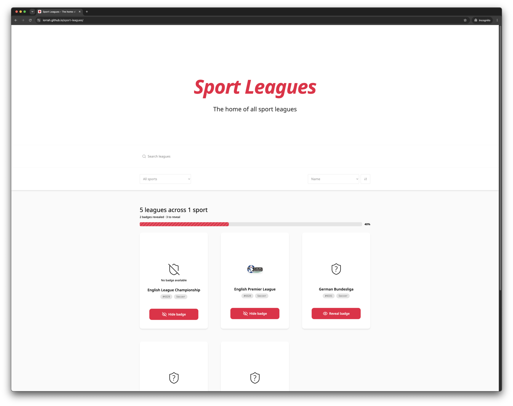

# Sport Leagues Explorer

A lightweight React + TypeScript app for discovering sport leagues from TheSportsDB.

## Documentation

- [Run & Setup](docs/run.md) — install, local dev, build, test, and deployment instructions.
- [Architecture](docs/architecture.md) — app structure, data flow, component design, and key decisions.
- [AI Process](docs/ai-process.md) — notes on AI-assisted development, review, and implementation lessons.

## Live Demo

View the deployed app on GitHub Pages:

https://iorrah.github.io/sport-leagues/

## Notes

The detailed usage and implementation docs are stored in the `docs/` folder.
