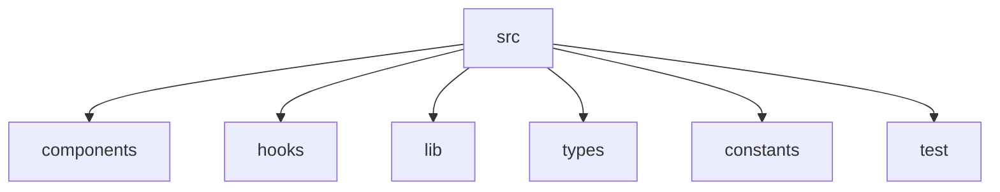

# Architecture

## Overview

This project is a single-page React application built with Vite and TypeScript. It fetches league data from TheSportsDB API, applies client-side filtering, sorting, and search, and supports badge reveal interactions with cached badge requests.

The architecture intentionally keeps domain logic separate from UI concerns, with a lean app shell and isolated helpers for search normalization, filtering, and sorting.

## Governing rules

- Single source of truth for search normalization: raw input is kept in the search bar, but normalized search is derived in `App.tsx` and reused by both filtering and highlighting.
- Data is treated as reference data whenever possible. League metadata is fetched once and not refetched on window focus.
- Failure states are explicit and scoped: global list failures do not look like per-card failures, and empty-but-valid results are not mistaken for errors.
- UI responsibilities are limited to rendering state; business logic lives in `src/lib` and custom hooks.

## Component structure & responsibilities

- `src/App.tsx`
  - Orchestrates global state and derived values.
  - Manages selected sport, sort order, raw search, and revealed league IDs.
  - Computes debounced and normalized search text.
  - Invokes `filterLeagues()` and `sortLeagues()` before rendering `LeagueGrid`.

- `src/components/SearchBar.tsx`
  - Presents a controlled text input.
  - Emits raw user input only; it does not normalize or filter.

- `src/components/ControlsBar.tsx`
  - Renders sport filter pills and sort controls.
  - Emits selection events upward to preserve state in `App`.

- `src/components/LeagueGrid.tsx`
  - Renders the league collection along with empty and error states.
  - Uses `ErrorBoundary` around card rendering so one bad card cannot crash the whole grid.

- `src/components/LeagueCard.tsx`
  - Displays league details and a reveal interaction.
  - Triggers badge fetch only when the user explicitly clicks reveal.
  - Renders loading, success, and distinct per-card error/empty states.

- `src/hooks/useLeagues.ts`
  - Fetches league list via TanStack Query.
  - Uses durable query options to minimize unnecessary revalidation.

- `src/hooks/useLeagueBadge.ts`
  - Fetches badge metadata on demand.
  - Caches one entry per league and avoids eager loading.

- `src/lib/filters.ts`
  - Contains `normalizeSearch()`, `filterLeagues()`, and `sortLeagues()`.
  - Keeps matching rules deterministic and testable.

## State flow

The application separates UI state from server state. UI state lives in `App.tsx` and flows down to controls and cards. Server state is managed by TanStack Query and cached independently.

```mermaid
flowchart TD
  A[User interacts with SearchBar / ControlsBar] --> B[App state]
  B --> C[Debounced raw search]
  C --> D[Normalized search]
  D --> E[filterLeagues()]
  E --> F[Filtered league list]
  F --> G[LeagueGrid]
  G --> H[LeagueCard]
  H --> I[useLeagueBadge() if reveal clicked]

  subgraph ServerState
    J[useLeagues query: ['leagues']]
    K[useLeagueBadge query: ['badge', leagueId]]
  end

  B --> J
  H --> K
```

### UI state

- `rawSearch` — text typed by the user.
- `selectedSport` — current sport filter.
- `sortOrder` — current sort selection.
- `revealedLeagueIds` — league IDs whose badge reveal has been requested.

### Server state

- `['leagues']` — full league list from TheSportsDB.
- `['badge', leagueId]` — badge metadata for each revealed league.

## Caching strategy

The app favors cache stability and predictable behavior.

- `['leagues']`
  - fetched once
  - `staleTime: Infinity`
  - `refetchOnWindowFocus: false`
  - Reason: league metadata is reference data and should not trigger silent background reloads for the ~1,500-record list.

- `['badge', leagueId]`
  - one cache entry per league
  - enabled only after the card reveal is clicked
  - Reason: badge requests are user-triggered and should not load on mount for every card.

- 429 handling
  - The API client catches rate-limit responses and surfaces a typed `RateLimitError`.
  - This is shown as a distinct UI state: "rate limited, please wait a moment" rather than a generic failure.
  - TheSportsDB free tier is capped at 30 requests/minute, which makes per-badge caching far more important than pagination.

- distinct failure states
  - Initial leagues fetch fails → page-level error state with retry.
  - Badge request fails (network/500) → per-card "Couldn't load badge — retry.".
  - Badge request succeeds but returns no seasons → per-card "No badge available for this league." This is a valid empty result, not an error.

## Rendering details

- Skeleton loading
  - `LeagueGrid` renders skeleton placeholders while `useLeagues()` is loading.
  - This keeps the page stable and provides user feedback during the initial fetch.

- Match highlighting
  - Search matching is normalized and applied consistently to both filtering and the highlight engine.
  - The highlight regex is built from escaped user input so the UI does not break on special characters.

- Error boundary
  - A rendering boundary is used to isolate `LeagueCard` errors from the rest of the page.
  - If a card throws, the search bar, hero, and controls remain interactive.

## Config & resilience

- `.env` / `.env.example`
  - Both files are committed with placeholder values.
  - No API key is hardcoded in the fetch wrapper.

- Query client defaults
  - `refetchOnWindowFocus: false`
  - Reason: league data rarely changes mid-session, and background refetch on tab focus adds unnecessary noise.

- Fetch timeouts
  - The API client uses `AbortController` with a ~10 second timeout.
  - This is independent of TanStack Query's retry/backoff behavior.

- Error semantics
  - Errors are typed and surfaced according to scope.
  - A generic network failure is not used for empty-but-valid responses.

## Testing

Testing is layered to match the architecture and maximize coverage across responsibilities.

- Pure logic
  - `src/lib/filters.ts` unit tests cover `normalizeSearch()`, `filterLeagues()`, and `sortLeagues()`.
  - `useDebouncedValue()` is tested as a pure timing utility without rendering the entire UI.

- Data hooks
  - `useLeagues` and `useLeagueBadge` are tested with `renderHook` and MSW-mocked responses.
  - Tests cover success, network error, rate-limit error, and empty result cases separately.

- Integration
  - End-to-end UI behavior is validated by interacting with the search input, asserting grid updates, clicking reveal, and verifying card effects.

- Error boundary
  - A test forces a render error inside a mocked `LeagueCard`.
  - It asserts that the rest of the page (search bar, hero, controls) continues to render.

## Folder structure



- `components/` contains reusable UI pieces.
- `hooks/` contains custom hooks for query and debounce.
- `lib/` contains API clients and pure logic.
- `types/` contains shared TypeScript type definitions.
- `constants/` contains environment- and app-specific constants.

## Notes

The architecture is designed to be simple, testable, and resilient while supporting senior-level application behavior such as deliberate caching, clear failure semantics, and explicit render-state handling.
